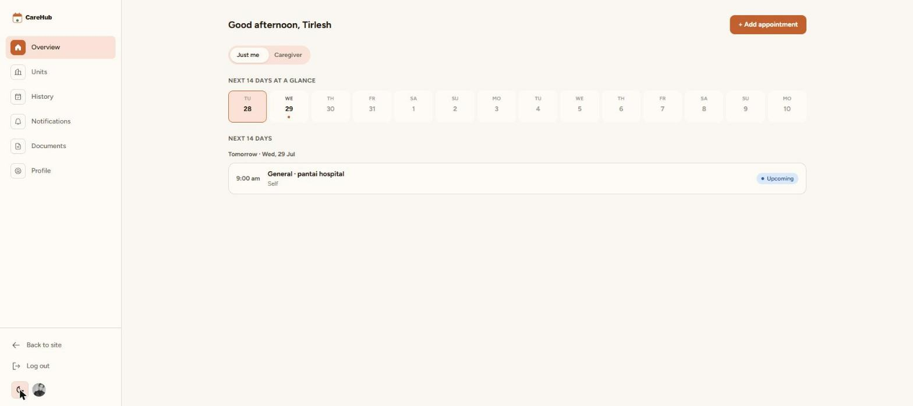
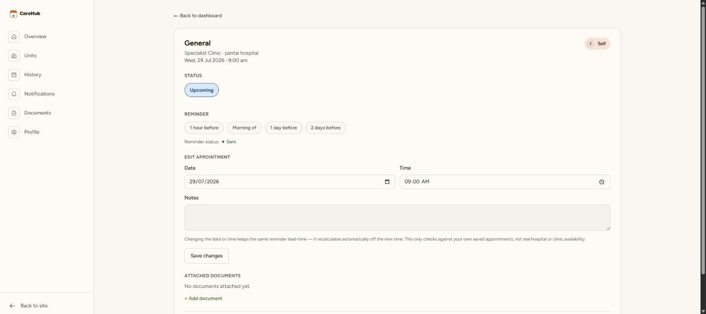

# CareHub

A full-stack, role-based web application that helps Penang-based patients and caregivers track medical appointments across multiple healthcare providers in one place.

**Live app:** https://carehub-theta.vercel.app

## The problem

Patients and caregivers managing appointments across multiple clinics/providers have no single place to track them — CareHub centralizes that, with per-user access control so each account only ever sees its own data.

## Screenshots

| Landing page | Upcoming appointments | Appointment detail |
|---|---|---|
|  |  |  |

## Features

- Role-based accounts (patient / caregiver) via Clerk authentication
- Appointment tracking across multiple providers
- Automated email reminders — a scheduled Supabase Edge Function (triggered via `pg_cron`/`pg_net`) sends reminders through Resend
- Document upload support via Supabase Storage
- Per-user data isolation enforced at the database level with Postgres Row-Level Security policies on every table
- Custom design system (clay & moss color tokens, Figtree for UI text, Lora for headings)

## Tech stack

| Layer | Technology |
|---|---|
| Frontend | Next.js 16, TypeScript, Tailwind CSS v4 |
| Auth | Clerk |
| Database | Supabase (PostgreSQL), Row-Level Security |
| Storage | Supabase Storage |
| Background jobs | Supabase Edge Functions, `pg_cron`, `pg_net` |
| Email | Resend |
| Hosting | Vercel (`sin1` region, matched to Supabase `ap-southeast-1`) |

## What I built end-to-end

Solo capstone project (WOU Web Development Capstone) — data model, UI/UX, auth flow, RLS policy design, the scheduled reminder pipeline, and production deployment, all done independently.

## Running locally

```bash
git clone https://github.com/kwebbelkop62-glitch/carehub.git
cd carehub
npm install
cp .env.example .env.local
# fill in .env.local with your own Supabase and Clerk values
npm run dev
```

The `send-reminders` Supabase Edge Function is deployed and configured separately (its own secrets, set via `supabase secrets set` — see `.env.example` for details) and isn't required to run the app locally.
